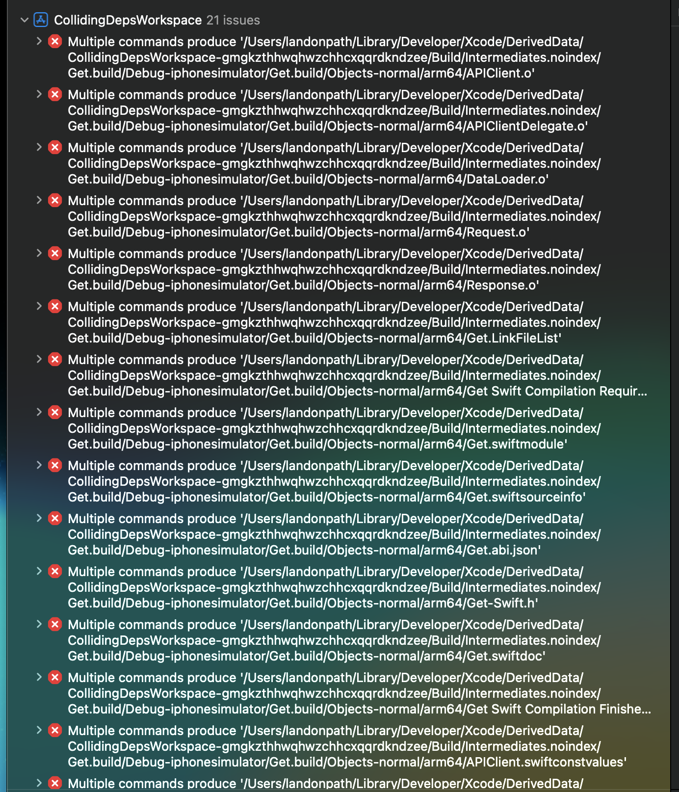
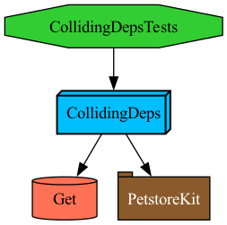

# CollidingDeps Tuist Minimal Reproduction

## Issue:

When trying to integrate an SPM package that has a common dependency w/ my Tuist workspace, I believe the dependency gets like replicated, once in the Tuist dependencies, and then once in the native SPM dependencies.

## Errors:

## Dependency Graph

